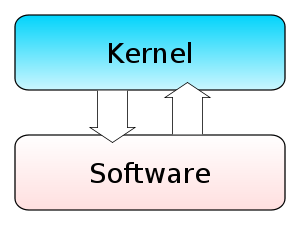
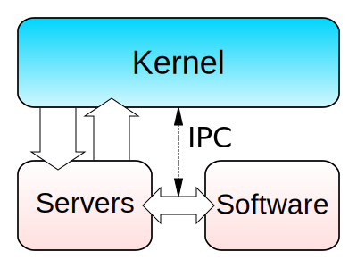
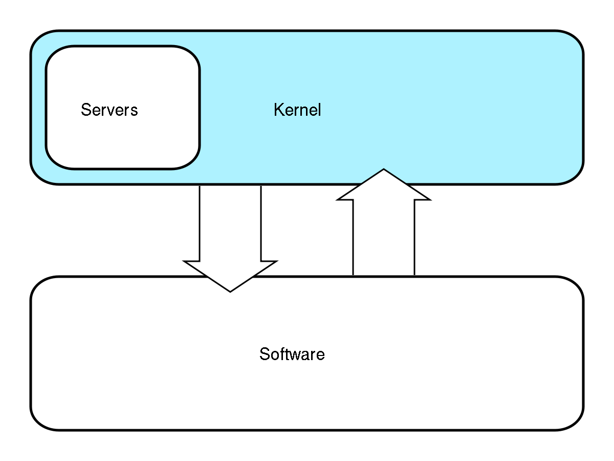
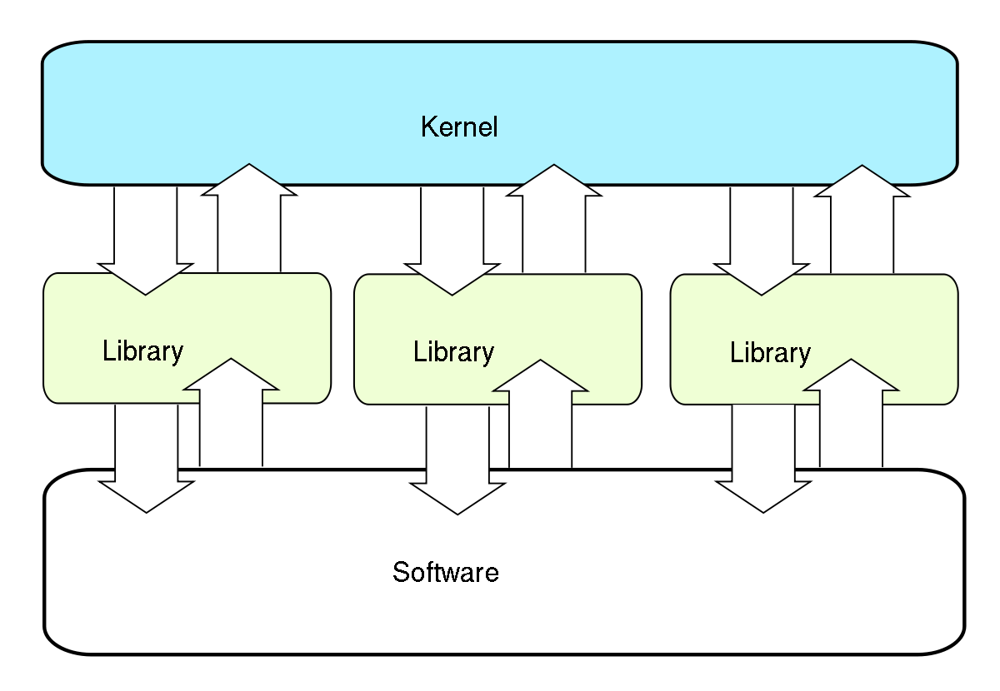
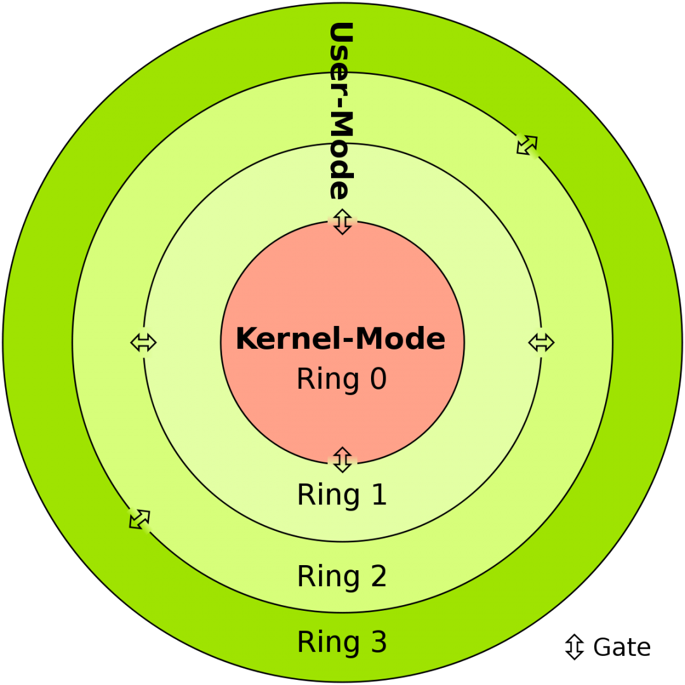

# SISTEMAS OPERATIVOS - ACTIVIDAD 1

## TIPOS DE KERNEL Y SUS DIFERENCIAS
El kernel es una parte fundamental del sistema operativo que actúa como intermediario entre el hardware y el software, gestionando los recursos del sistema y facilitando la comunicación entre las aplicaciones y el hardware. Hay varios tipos de kernels, y sus diferencias principales radican en la forma en que manejan las interrupciones, la memoria y la multitarea. Algunos tipos de kernels comunes son los siguientes:

1. **Kernel Monolítico:** En este enfoque, todas las funciones del kernel se ejecutan en el mismo espacio de memoria.
   - **Características:**
     - Mayor rendimiento ya que las funciones del kernel se ejecutan de manera directa y eficiente.
     - Menor sobrecarga de cambio de contexto.
     - Linux es un ejemplo de un sistema operativo con un kernel monolítico.
     

2. **Kernel Microkernel:** Solo las funciones esenciales del kernel se ejecutan en el espacio del kernel, y los servicios adicionales se ejecutan como procesos separados fuera del kernel.
   - **Características:**
     - Mayor modularidad y extensibilidad del sistema.
     - Menor tamaño del kernel y mayor estabilidad.
     - Ejemplos incluyen el kernel Mach utilizado en el sistema operativo macOS y algunos microkernels de sistemas embebidos.
     

3. **Kernel Híbrido:** Combina características de los kernels monolíticos y microkernels.
   - **Características:**
     - Ofrece la eficiencia de los kernels monolíticos y la modularidad de los microkernels.
     - Windows NT es un ejemplo de un sistema operativo con un kernel híbrido.
     

4. **Kernel Exokernel:** Delega la mayor parte de las decisiones de gestión de recursos a las aplicaciones en lugar de realizarlas en el kernel.
   - **Características:**
     - Proporciona un mayor grado de control a las aplicaciones.
     - Requiere que las aplicaciones sean más conscientes y responsables de la gestión de recursos.
     - Se utiliza en entornos de investigación y desarrollo.
     

## USER VS KERNEL MODE
La diferencia principal entre el modo usuario y el modo kernel es el nivel de acceso y control sobre los recursos del sistema:

- **Modo usuario:** Es el modo por defecto en el que se ejecutan la mayoría de los programas y aplicaciones. Tiene acceso limitado al hardware, memoria y CPUs. Proporciona protección y aislación entre procesos. Si un programa falla en este modo, solo afecta a ese proceso.

- **Modo kernel:** Es un modo privilegiado y tiene acceso completo al hardware y recursos del sistema. Se utiliza para ejecutar el código del kernel, controladores de dispositivo y código del sistema operativo de bajo nivel. Un error en este modo puede provocar un fallo completo del sistema.

El paso entre el modo usuario y modo kernel requiere una llamada al sistema o una interrupción de hardware. Esto cambia del contexto de ejecución a uno supervisado por el kernel para acceder a recursos protegidos o proporcionar un servicio al proceso.

## INTERRUPTIONS VS TRAPS
Las principales diferencias entre interrupts y traps son:

- Origen:
    - Las interrupciones son generadas por eventos externos al procesador como señales de hardware. 

    - Las trampas son generadas por la ejecución de instrucciones especiales o excepciones de software.

- Asincronía:

    - Las interrupciones ocurren de forma asíncrona al procesador. 

    - Las trampas son síncronas con la ejecución de instrucciones.

- Reanudación:

    - Después de una interrupción se reanuda la ejecución donde se quedó.

    - Las trampas pueden reanudar después o no, dependiendo de la causa.

- Latencia: 

    - Las interrupciones pueden tener alta latencia si ocurren durante operaciones críticas.

    - Las trampas tienen baja latencia al ser síncronas.

- Uso:

    - Las interrupciones se usan para eventos externos como E/S. 

    - Las trampas se usan para debug, excepciones, llamadas al sistema.

### INTERRUPTIONS

### TRAPS

