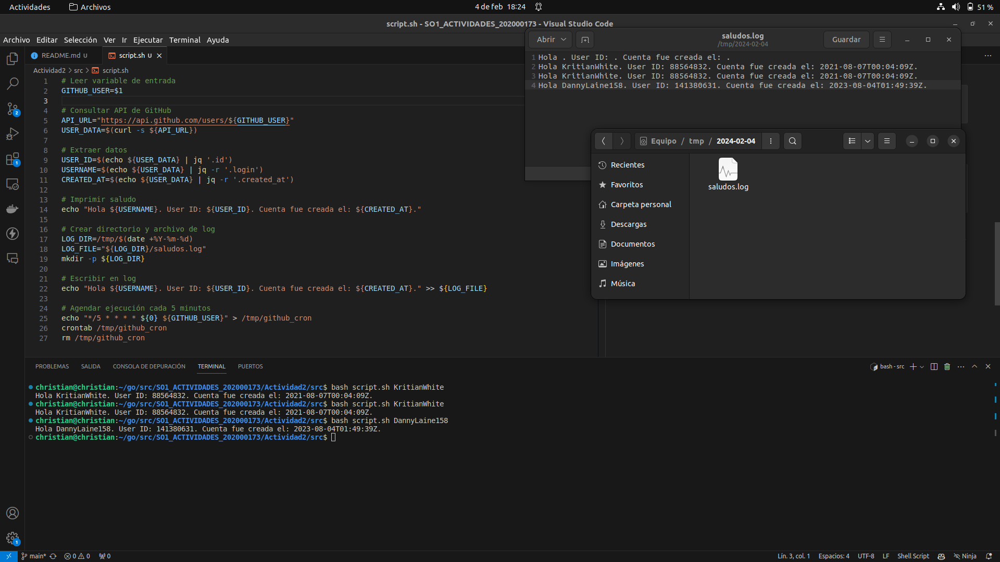

# SCRIPTING - ACTIVIDAD 2

## script.sh

1. **Lectura de variable de entrada:**
   ```bash
   GITHUB_USER=$1
   ```
   El script toma el primer argumento que se le pasa al ejecutarse y lo asigna a la variable `GITHUB_USER`. Este argumento debería ser el nombre de usuario de GitHub del cual se desea obtener información.

2. **Consulta a la API de GitHub:**
   ```bash
   API_URL="https://api.github.com/users/${GITHUB_USER}"
   USER_DATA=$(curl -s ${API_URL})
   ```
   Se construye la URL de la API de GitHub utilizando el nombre de usuario proporcionado. Luego, se utiliza `curl` para hacer una solicitud a esa URL y se guarda la respuesta en la variable `USER_DATA`. La opción `-s` se utiliza para realizar la solicitud en silencio, sin mostrar la información del progreso.

3. **Extracción de datos con jq:**
   ```bash
   USER_ID=$(echo ${USER_DATA} | jq '.id')
   USERNAME=$(echo ${USER_DATA} | jq -r '.login')
   CREATED_AT=$(echo ${USER_DATA} | jq -r '.created_at')
   ```
   Se utiliza `jq` para extraer información específica de la respuesta JSON de la API. En este caso, se extraen el ID de usuario, el nombre de usuario y la fecha de creación de la cuenta de GitHub.

4. **Impresión de saludo:**
   ```bash
   echo "Hola ${USERNAME}. User ID: ${USER_ID}. Cuenta fue creada el: ${CREATED_AT}."
   ```
   Se imprime un saludo en la consola con la información obtenida del usuario de GitHub.

5. **Creación de directorio y archivo de log:**
   ```bash
   LOG_DIR=/tmp/$(date +%Y-%m-%d)
   LOG_FILE="${LOG_DIR}/saludos.log"
   mkdir -p ${LOG_DIR}
   ```
   Se crea un directorio en `/tmp` con el formato de fecha y se define el nombre de archivo de registro. La opción `-p` de `mkdir` permite crear directorios anidados si no existen.

6. **Escritura en el log:**
   ```bash
   echo "Hola ${USERNAME}. User ID: ${USER_ID}. Cuenta fue creada el: ${CREATED_AT}." >> ${LOG_FILE}
   ```
   Se agrega la misma información de saludo al archivo de registro.

7. **Programación de tarea cron:**
   ```bash
   echo "*/5 * * * * ${0} ${GITHUB_USER}" > /tmp/github_cron
   crontab /tmp/github_cron
   rm /tmp/github_cron
   ```
   Se crea un archivo temporal `github_cron` con la configuración de cron para ejecutar el script cada 5 minutos. Luego, se establece esta configuración como la tarea cron actual y se elimina el archivo temporal.

## EJECUTANDO EL SCRIPT

Para ejecutar el script, utilizar el siguiente comando en la línea de comandos:

```bash
bash script.sh usuario-github
```

Asegúrate de reemplazar "usuario-github" con el nombre de usuario de GitHub del cual deseas obtener la información. Este comando ejecutará el script bash y pasará el nombre de usuario como argumento al script.

En la siguiente imagen podemos ver la salida en consola como tambien en el archivo `saludos.log` de la carpeta creada con la fecha (`2024-04-02`) de cuando se ejecutó dicho script:

